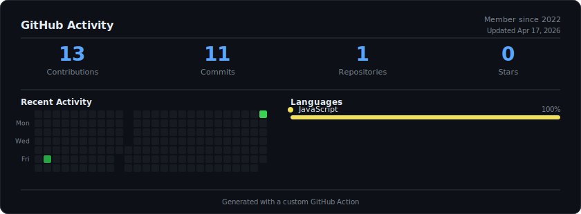

<div align="center">

# Ryan van Brunschot

**Founder at [Unique Design B.V.](https://unique-design.nl)**

Tilburg, The Netherlands

[](https://linkedin.com/in/ryan-van-brunschot/)
[](mailto:ryan@unique-design.nl)
[](https://unique-design.nl)

</div>

---

### About

Digital agency owner building custom WordPress solutions — from tailor-made themes and plugins to complex API integrations. Focused on clean code, fast performance, and thoughtful design.

Visit **[unique-design.nl](https://unique-design.nl)** to see our work.

---

### Tech Stack

**Languages**


**Frameworks & Libraries**


**Databases & Search**


**Infrastructure & DevOps**


**AI & Automation**


**Design & Tools**


---

### What I Do

```text
WordPress Development    ████████████████████░░   Custom themes, plugins & Gutenberg blocks
API Integrations         ██████████████████░░░░   REST APIs, webhooks & third-party connections
Performance & Hosting    ████████████████░░░░░░   Server optimization, caching & CDN setup
AI-Powered Workflows     ██████████████░░░░░░░░   Automation with Claude, n8n & custom tooling
```

---

### Activity

<div align="center">
  
</div>

---

<div align="center">

*Building digital products that are fast, clean, and built to last.*

</div>
